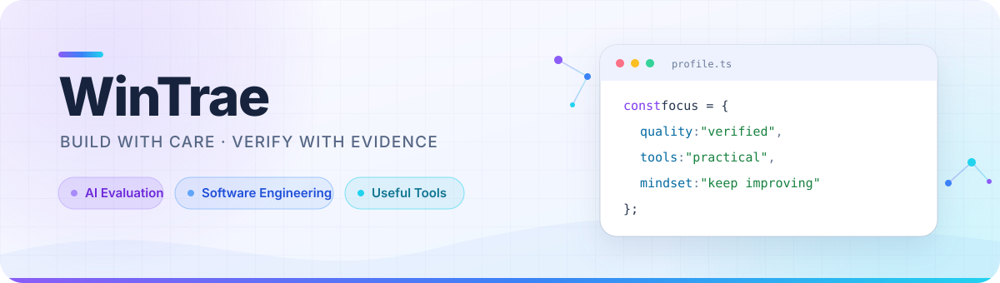

<p align="center">
  
</p>

<p align="center">
  <a href="https://github.com/WinTrae/codex-node-guardian"></a>
  
  
</p>

<p align="center">
  
  
  
  
  
  
  
  
</p>

## Hello, I'm WinTrae

<table>
<tr>
<td width="50%" valign="top">

### What I care about

- Evidence-based AI evaluation and Agent QA
- Reliable backend systems and automation
- Small tools that solve real, everyday problems
- Clear decisions, careful verification, continuous improvement

</td>
<td width="50%" valign="top">

### Beyond the keyboard

- 🏀 Basketball
- ⛳ Golf
- 🎮 Video games
- 🧪 Turning curious ideas into working software

</td>
</tr>
</table>

## Featured work

<table>
<tr>
<td width="100%">

### ⚡ [Codex Node Guardian](https://github.com/WinTrae/codex-node-guardian)

A privacy-safe Windows node health monitor and cautious failover guardian for Clash / Mihomo.

`Python` `PowerShell` `Windows` `Clash/Mihomo` `56 offline tests`

- Fast health checks, standby candidates and controlled recovery
- Success-rate, P95 latency, jitter and history-aware decisions
- Dry-run safety mode before any real switching
- Public repository contains source code only—no personal configuration or runtime data

➡️ **[Explore the source](https://github.com/WinTrae/codex-node-guardian)**

</td>
</tr>
</table>

## Currently building

```text
practical tools  →  safer automation  →  reliable results
```

<p align="center">
  <sub>Build carefully · Verify honestly · Keep improving</sub>
</p>
